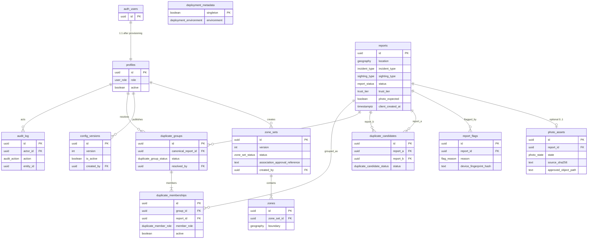

# Database ERD

Project-owned tables only. Exact names and constraints live in
[`../../db/schema.sql`](../../db/schema.sql). This diagram omits RPC functions,
RLS, and Supabase-owned Auth/Storage catalogs.

## Table responsibilities

One job per table. State machines and retention stay in
[`../DATA-MODEL.md`](../DATA-MODEL.md).

| Table | Responsibility |
|---|---|
| `auth_users` | Supabase-owned login and session. Not a project table. |
| `profiles` | Maps a provisioned account to `association` or `administrator`. Public reporters have no row. |
| `reports` | The sighting itself: what, where, when, and moderation status. Center of the model. |
| `photo_assets` | Optional sanitized photo for one report: processing, approval, rejection, purge. Raw EXIF is never stored. |
| `report_flags` | Public “this report is invalid” complaints, with a temporary origin hash. |
| `duplicate_candidates` | Automatic “these two look similar” suggestions. Detection does not hide or merge. |
| `duplicate_groups` | Human decision that a set is the same sighting. Reversible and audited. |
| `duplicate_memberships` | Which report is canonical and which reports stay linked. |
| `zone_sets` | One versioned Creel geofence (draft / active / retired) plus external approval citation. |
| `zones` | The actual polygon for that version: inside vs outside. |
| `config_versions` | Operational numbers: flag threshold, GPS accuracy, duplicate window. |
| `audit_log` | Who hid, restored, resolved duplicates, or changed rules. |
| `deployment_metadata` | This project is `staging` or `production`. |

## How the tables group

| Cluster | Meaning |
|---|---|
| Content | `reports` + `photo_assets` + `report_flags` |
| Accounts | `auth_users` + `profiles` |
| Rules | `zone_sets` + `zones` + `config_versions` |
| Duplicate cleanup | `duplicate_candidates` + `duplicate_groups` + `duplicate_memberships` |
| Operations | `audit_log` + `deployment_metadata` |

## Intentionally not drawn

- The 35 SQL RPCs. Those are the API, not entities.
- Trust score columns, retention timestamps, and every `reports` check.
- `storage.objects`. Only `photo_assets.approved_object_path` points at a private object.
- Public 50 m coordinates. The exact point is stored; the approximation is computed on read.

## Cardinality notes

- One report, zero or one photo.
- One report may have many flags; one fingerprint may flag a report once.
- A report may belong to at most one **active** duplicate membership.
- One environment may have at most one **active** zone set and one **active** config version.
