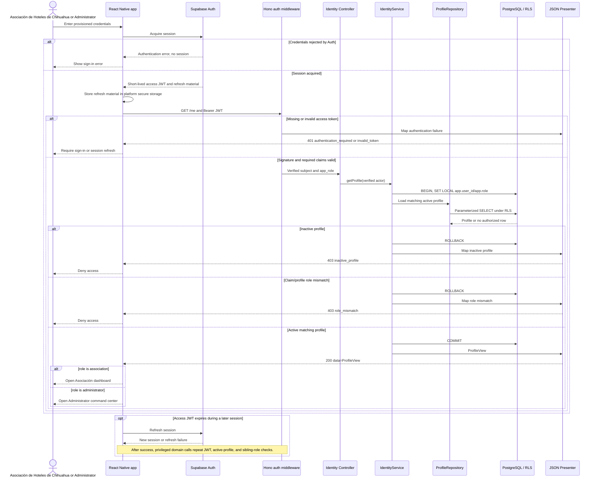

# Sequence: Authenticated sign-in and role routing

Supabase Auth acquires or refreshes the session. The app then calls the Hono API
for the authoritative active profile; a token alone never grants role access.

## Sources

- [`../../API.md`](../../API.md): `GET /me`, response envelope, and authentication errors.
- [`../../SECURITY.md`](../../SECURITY.md): manual provisioning, secure refresh storage, and fail-closed profile checks.
- [`../../architecture/DECISIONS.md`](../../architecture/DECISIONS.md): ADR-001, ADR-012, ADR-018, and ADR-019.
