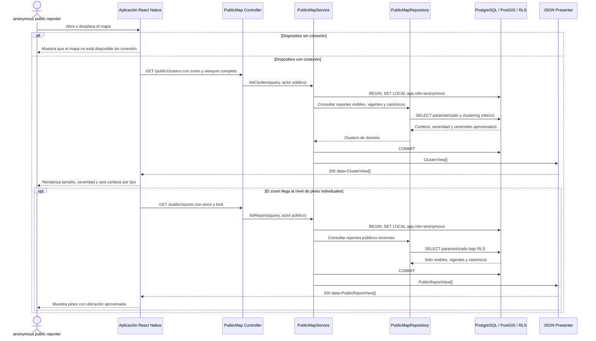

# Secuencia: mapa público de reportes

El mapa es online y consume exclusivamente proyecciones públicas de la API Hono.
Las ubicaciones individuales y agregadas usan la misma aproximación métrica,
estable y determinista de 50 m.

## Rutas y privacidad

| Ruta | Uso | Exclusiones obligatorias |
|---|---|---|
| `GET /public/clusters?zoom=<0..22>&min_longitude=&min_latitude=&max_longitude=&max_latitude=&limit=<1..5000>` | Clusters del viewport; los cuatro límites se envían juntos o se omiten | Coordenadas exactas, rutas privadas y miembros no canónicos |
| `GET /public/reports?since=<timestamp>&limit=<1..1000>` | Pines públicos recientes | Coordenadas exactas, campos privados y reportes no visibles, vencidos o no canónicos |

Las rutas públicas no requieren `Authorization`; un token suministrado pero
inválido produce `401 invalid_token` y nunca se degrada a acceso anónimo.

## Fuentes

- [`../../API.md`](../../API.md): consultas públicas y formas `ClusterView`/`PublicReportView`.
- [`../../DATA-MODEL.md`](../../DATA-MODEL.md): clustering métrico, severidad y aproximación de 50 m.
- [`../../SECURITY.md`](../../SECURITY.md): minimización y protección contra triangulación.
