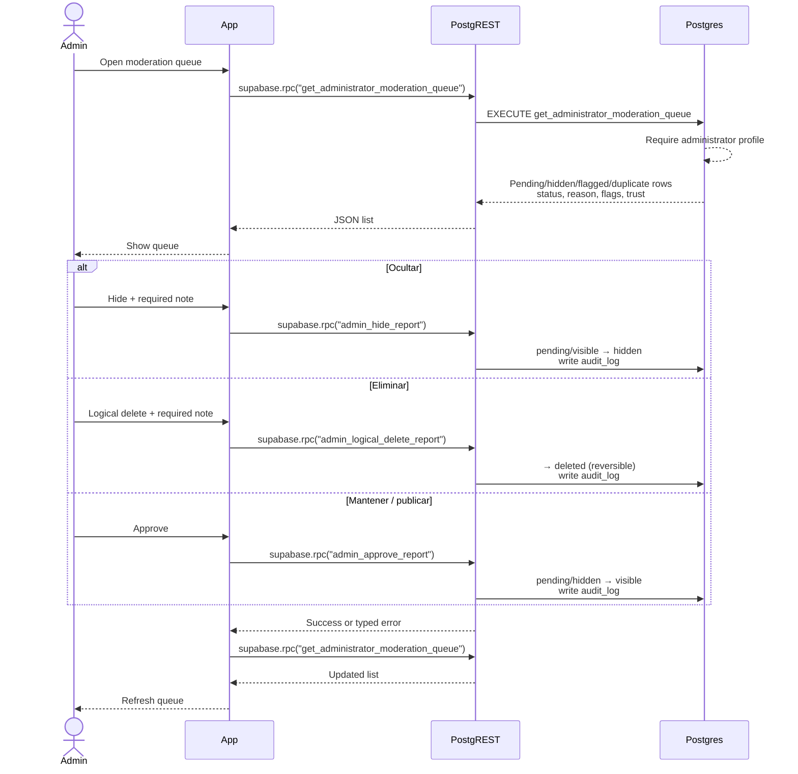

# Sequence: Administrator moderation queue

Replaces the old `GET /api/admin/reportes` and `PATCH /api/admin/reportes/{id}`
flow. There is no custom Controller. PostgREST exposes SQL RPCs.

**Mantener** in the original task is mapped to `admin_approve_report` (keep /
publish after review). Leaving the row untouched needs no RPC.

## Call mapping

| UI action | RPC | Effect |
|---|---|---|
| Enter queue | `get_administrator_moderation_queue` | Read-only list with flag reasons and counts |
| Ocultar | `admin_hide_report` | `hidden`; note required |
| Eliminar | `admin_logical_delete_report` | Logical `deleted`; reversible; note required |
| Mantener | `admin_approve_report` | `visible`; starts/restarts public window |
| Restore later | `admin_restore_report` | `hidden`/`deleted` → `pending_review` (not in this screen’s three buttons) |

The original report fields are never edited. Association BI RPCs are not used here.
