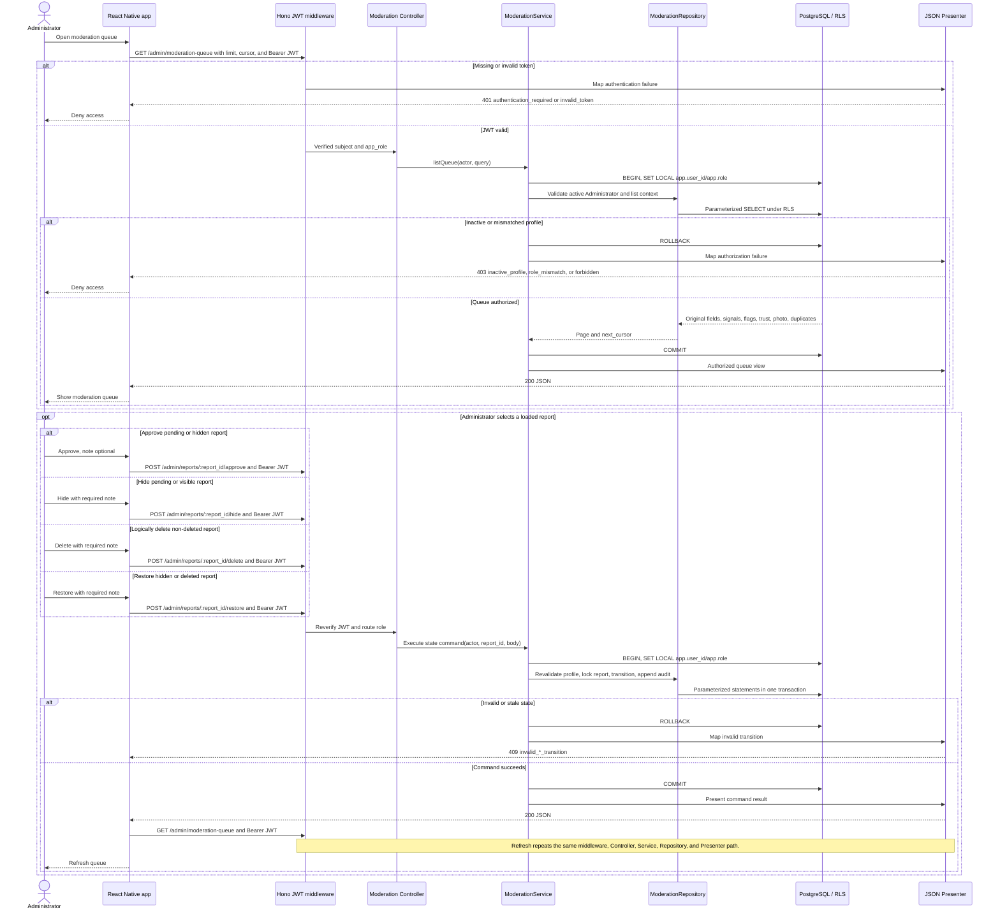

# Sequence: Administrator moderation queue

Administrator reads moderation context and executes audited state commands. The
original report content is immutable through this flow, and Administrator does
not inherit Asociación de Hoteles de Chihuahua BI/export access.

## State effects

| Command | Effect |
|---|---|
| `POST /admin/reports/:report_id/approve` | `pending_review`/`hidden` → `visible`; starts or restarts the 90-day public window |
| `POST /admin/reports/:report_id/hide` | `pending_review`/`visible` → `hidden` |
| `POST /admin/reports/:report_id/delete` | Any non-deleted state → reversible `deleted`; never hard-deletes |
| `POST /admin/reports/:report_id/restore` | `hidden`/`deleted` → `pending_review`; approval is still required to publish |

Every successful command locks, transitions, and appends audit evidence in the
same transaction. Hard deletion belongs only to retention.

## Sources

- [`../../API.md`](../../API.md): Administrator queue, command routes, bodies, and errors.
- [`../../DATA-MODEL.md`](../../DATA-MODEL.md): moderation state machine and retention.
- [`../../SECURITY.md`](../../SECURITY.md): sibling roles, immutable evidence, and audit controls.
