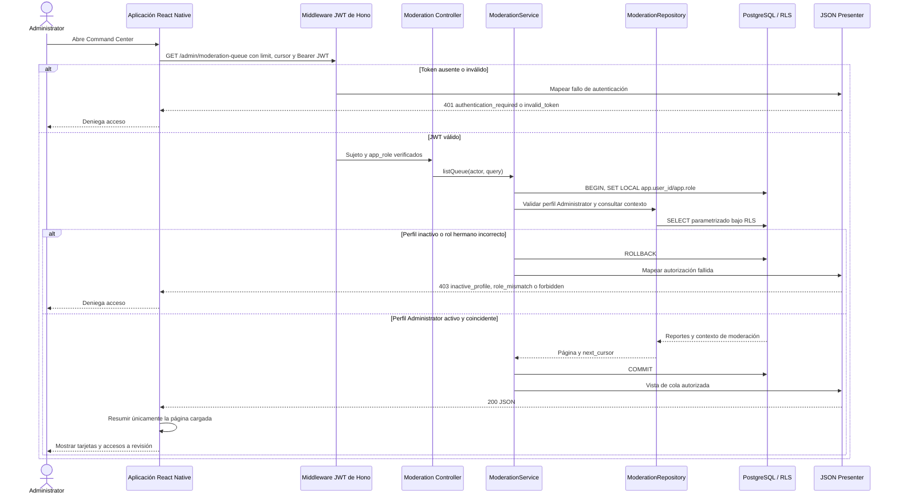

# Secuencia: Command Center de Administrator

El contrato no define un endpoint agregado de dashboard. El Command Center usa la
cola de moderación contratada y solo puede resumir localmente la página recibida;
no obtiene BI de la Asociación de Hoteles de Chihuahua.

## Alcance y brecha contractual

- Ruta utilizada: `GET /admin/moderation-queue?limit=<1..500>&cursor=`.
- La respuesta puede incluir campos originales, ubicación exacta, señales GPS,
  mock/honeypot, confianza, denuncias, foto y contexto de duplicados.
- No se modifica contenido original y no se consulta `GET /association/reports`.
- **Brecha:** `docs/API.md` no contrata `GET /admin/dashboard` ni estadísticas
  agregadas globales. Un resumen global requiere ampliar el contrato; este flujo
  no lo fabrica a partir de acceso directo a tablas.

## Fuentes

- [`../../API.md`](../../API.md): contrato de la cola de moderación.
- [`../../SECURITY.md`](../../SECURITY.md): roles hermanos y autorización en profundidad.
- [`../../architecture/DECISIONS.md`](../../architecture/DECISIONS.md): ADR-001, ADR-018 y ADR-019.
