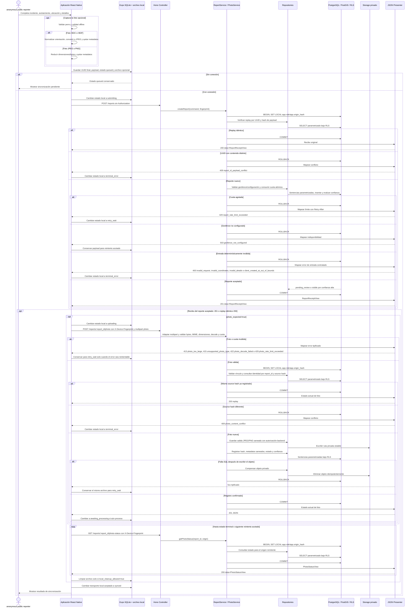

# Secuencia: creación y sincronización de reporte

El reporte se guarda primero en una cola local durable con su UUID final. La foto
única es opcional, permanece en un archivo privado local y se carga solo después
de aceptar el reporte.

Los estados locales `queued`, `submitting`, `uploading`, `awaiting_processing`,
`retry_wait`, `synced` y `terminal_error` nunca se escriben como estado de
moderación. Un `5xx` transitorio conserva payload y foto para reintentar el mismo
UUID/contenido. El servidor nunca persiste HEIC/HEIF ni EXIF crudo.
Los estados terminales de foto `approved`, `rejected`, `purge_pending` y `purged`
detienen el reintento; la retención conserva su flujo convergente de marcado,
borrado privado y confirmación.

## Brecha contractual

`docs/API.md` exige rechazar reportes nuevos fuera del geofence, pero no asigna un
código de error específico a ese caso. El diagrama no inventa uno; la ampliación
del contrato debe nombrarlo antes de implementarlo.

## Fuentes

- [`../../API.md`](../../API.md): `POST /reports` y rutas de estado/carga de foto.
- [`../../DATA-MODEL.md`](../../DATA-MODEL.md): estados locales, moderación, foto e idempotencia.
- [`../../SECURITY.md`](../../SECURITY.md): imagen no confiable, privacidad y límites durables.
