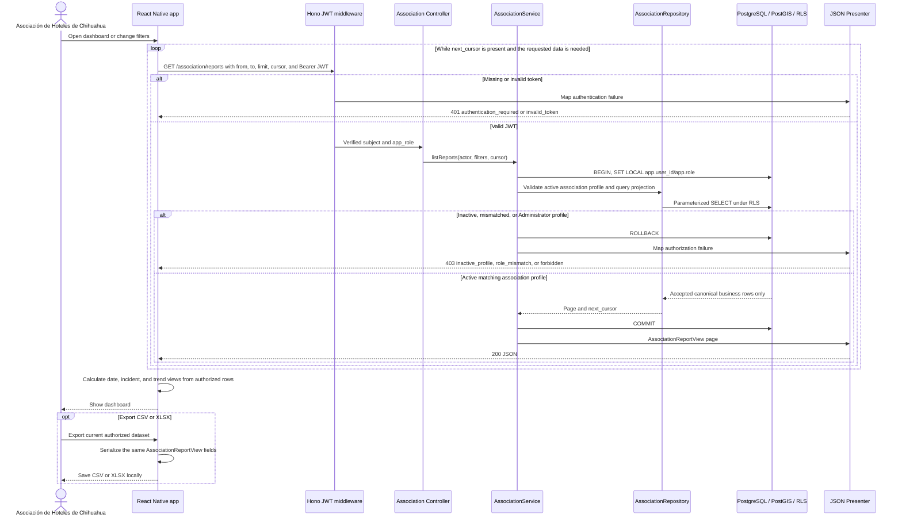

# Sequence: Asociación de Hoteles de Chihuahua dashboard and export

The dashboard reads only the accepted canonical business projection. Statistics
and CSV/XLSX files are derived in the app from that same paginated projection;
there is no separate statistics or export endpoint.

## Projection rules

Route: `GET /association/reports?from=&to=&limit=<1..5000>&cursor=`.

The projection includes accepted canonical business data retained for up to five
years. It excludes pending, hidden, deleted, non-canonical, fingerprint, raw EXIF,
flag, trust, moderation, private-path, and operator-identity data. Administrator
does not inherit this route.

## Contract gap

RF16 requires statistics by zone, but `AssociationReportView` does not include a
zone identifier and the API exposes no association zone-metadata or aggregate
route. The diagram therefore does not claim an official zone statistic; that
capability requires an explicit API contract extension.

## Sources

- [`../../API.md`](../../API.md): association route, pagination, fields, and export parity.
- [`../../DATA-MODEL.md`](../../DATA-MODEL.md): canonical disposition and retention.
- [`../../SECURITY.md`](../../SECURITY.md): sibling-role capability matrix.
