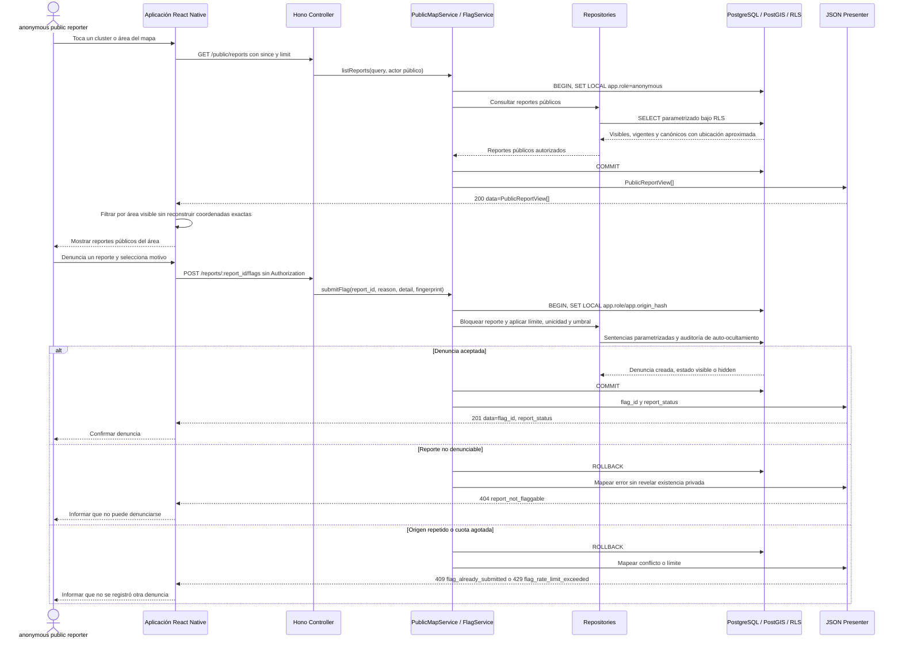

# Secuencia: detalle público de zona y denuncia

La API no expone una consulta por `zone_id` ni miembros de un cluster. La aplicación
usa la proyección pública contratada, filtra localmente por el área visible usando
solo ubicaciones aproximadas y envía la denuncia por la ruta pública exacta.

## Rutas y brecha contractual

| Ruta | Uso |
|---|---|
| `GET /public/reports?since=<timestamp>&limit=<1..1000>` | Obtener únicamente la proyección pública aproximada |
| `POST /reports/:report_id/flags` | Registrar motivo tipificado, detalle opcional y fingerprint de origen |

**Brecha:** no existe `GET /public/zones/:zone_id/reports`, consulta por viewport
para pines ni endpoint de miembros de cluster. Un detalle exacto por cluster/zona
requiere una ampliación de `docs/API.md`; no se sustituye con SQL directo.

## Fuentes

- [`../../API.md`](../../API.md): proyección pública, comando de denuncia y errores.
- [`../../DATA-MODEL.md`](../../DATA-MODEL.md): visibilidad, canonicidad y umbral de denuncias.
- [`../../SECURITY.md`](../../SECURITY.md): minimización de ubicación y diversidad de origen.
