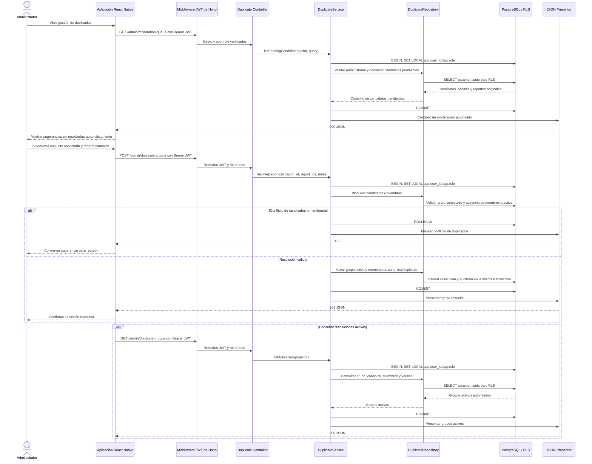

# Secuencia: resolver duplicados mediante selección canónica

La acción histórica “fusionar” significa seleccionar manualmente un reporte
canónico y vincular los demás como duplicados. No combina contenido, no modifica
evidencia original y no cambia ningún reporte a `deleted`.

## Efecto de la resolución

- `POST /admin/duplicate-groups` usa
  `{ "canonical_report_id": "uuid", "report_ids": ["uuid", "uuid"], "note"?: string }`.
- El canónico sigue sujeto a su estado de moderación; la resolución no lo publica.
- Los miembros no canónicos quedan excluidos de mapa público y proyección de la
  Asociación de Hoteles de Chihuahua mientras la membresía esté activa.
- Reportes, fotos y evidencia permanecen intactos y vinculados.
- La eliminación lógica es un comando de moderación independiente y reversible;
  nunca forma parte de la resolución de duplicados.

## Fuentes

- [`../../API.md`](../../API.md): cola de moderación y rutas de grupos duplicados.
- [`../../DATA-MODEL.md`](../../DATA-MODEL.md): grafo pendiente, membresías y canonicidad.
- [`../../architecture/DECISIONS.md`](../../architecture/DECISIONS.md): ADR-004 y ADR-018.
