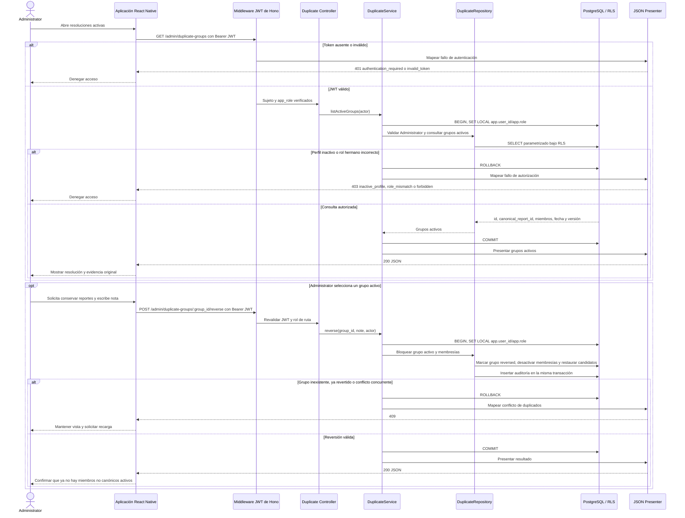

# Secuencia: conservar reportes y revertir una resolución de duplicados

Conservar todos los reportes ya resueltos se implementa revirtiendo el grupo
activo. Esto desactiva sus membresías y devuelve los candidatos a revisión; no
elimina reportes ni cierra definitivamente la sugerencia.

## Diferencia entre conservar, revertir y eliminar

| Acción | Resultado |
|---|---|
| Seleccionar canónico | Crea un grupo activo; no fusiona contenido ni elimina filas |
| `POST /admin/duplicate-groups/:group_id/reverse` | Revierte el grupo, desactiva membresías y restaura la revisión de candidatos |
| `POST /admin/reports/:report_id/delete` | Eliminación lógica independiente, reversible y auditada |
| Retención | Único proceso que puede borrar físicamente cuando corresponde |

## Brecha contractual

Aunque el modelo persistente admite candidatos `dismissed`, `docs/API.md` no
expone un comando para descartar una sugerencia pendiente como “no son
duplicados”. Por ello este diagrama solo permite conservar mediante reversión de
un grupo activo; no fabrica un endpoint `KEEP_BOTH` ni acceso directo a tablas.

## Fuentes

- [`../../API.md`](../../API.md): consulta y reversión exacta de grupos duplicados.
- [`../../DATA-MODEL.md`](../../DATA-MODEL.md): reversibilidad y restauración de candidatos.
- [`../../../db/schema.sql`](../../../db/schema.sql): estados `pending`, `confirmed`, `dismissed`, `active` y `reversed`.
